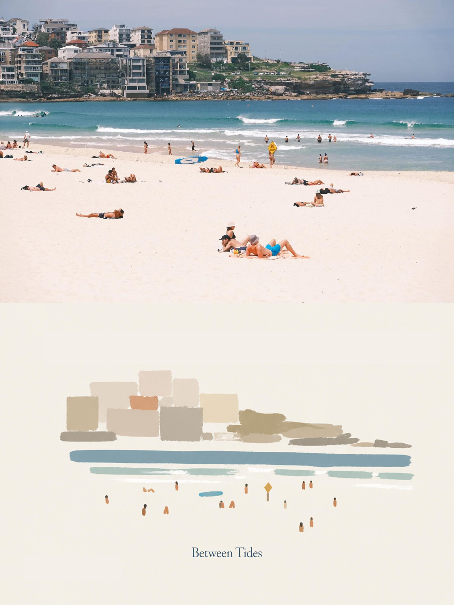
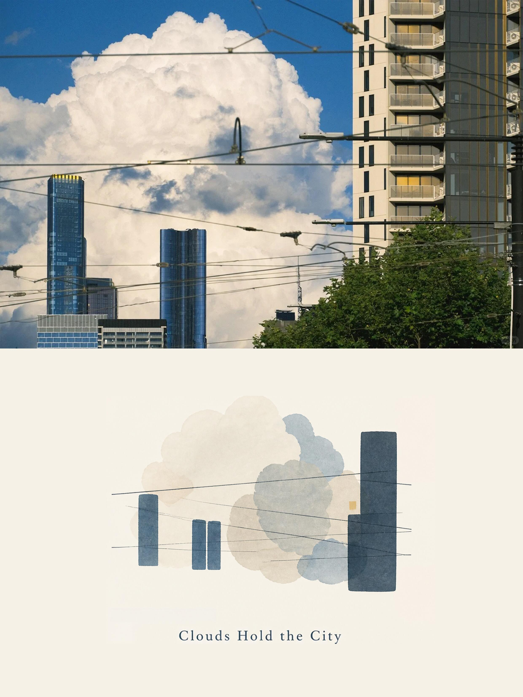

# Photo Abstract Editorial

将一张照片转化为“原始摄影区域 + 等尺寸抽象记忆面板 + 诗意英文标题”的编辑作品的 Codex Skill。它保留照片的原始像素尺寸，并仅从照片本身提炼空间关系、构图节奏和色彩关系；它不是滤镜、照片重画或风格迁移。

## 二次修改说明

本仓库是在原作者 [**ZzzLc0405**](https://github.com/ZzzLc0405) 的 [photo-abstract-editorial](https://github.com/ZzzLc0405/photo-abstract-editorial) 项目基础上进行的二次修改。原项目的创意、提示词体系、原始示例图片及相关版权声明均归原作者所有。

本次修改主要为了更好地适配竖版照片：抽象面板与原图保持完全相同的像素尺寸；横向照片采用上下拼接，竖向及正方形照片采用左右拼接。这样可以完整保留竖版原图，避免为了固定的纵向成品比例而缩放或裁切照片。

## 示例作品

### 本修改版新增示例

<p align="center">
  
  
  <br>
  
  
</p>

### 原项目保留示例

<p align="center">
  
  
  
</p>

## 使用方法

1. 将整个 `photo-abstract-editorial` 文件夹复制到你的 Codex skills 目录，例如 `~/.codex/skills/`。
2. 开启新的 Codex 对话，上传一张希望处理的照片。
3. 直接提出需求，例如：

   > 使用 `photo-abstract-editorial` 将这张照片制作成摄影与抽象面板组合的编辑作品。

4. Skill 会创建一张与原图像素尺寸完全相同的极简抽象面板。横向原图放在面板上方；纵向或正方形原图放在面板左方。成品中只保留一个原创英文标题（可选副标题）。

也可以直接打开下列文件，并将其作为图像生成提示词使用：

- 中文版：[references/photo-abstract-editorial-prompt.zh-CN.md](references/photo-abstract-editorial-prompt.zh-CN.md)
- English version: [references/photo-abstract-editorial-prompt.en.md](references/photo-abstract-editorial-prompt.en.md)

## 可自由调整的部分

这套提示词应当被视为高质量起点，而不是不可变的版式规范。请按自己的审美和项目需求修改以下参数：

- **抽象母题的版式**：可调整抽象母题的大小与留白，但不得改变原图与抽象面板一比一等尺寸的规则，也不得改变由原图方向决定的拼接位置。
- **颜色**：可修改象牙色面板背景、照片提取色的饱和度、主色与强调色的数量和倾向。
- **抽象形式**：可选择或混合色块、柔和有机质量、弧形笔触、短条、层叠色带、简化建筑质量、细线、点状标记等形式。
- **版式与文字**：可调整母题位置、标题位置、字体气质、标题长度和是否使用副标题。
- **抽象程度**：可根据题材在“关系优先”和“保留少量身份特征”之间调整，例如让地标建筑或小型物件保留更多辨识线索。

调整时建议保留两条核心原则：

1. 上传照片始终是唯一内容来源，照片区域不应被重画、扩展或改写。
2. 抽象面板中的每个重要元素都应能追溯到原照片中真实存在的空间、色彩或结构事实。

## 内容结构

```text
photo-abstract-editorial/
├── SKILL.md                         # Skill 工作流程与约束
├── agents/openai.yaml               # Codex 界面元数据
├── scripts/compose_editorial.py      # 等尺寸校正、拼接与像素验证
├── references/
│   ├── photo-abstract-editorial-prompt.zh-CN.md
│   └── photo-abstract-editorial-prompt.en.md
└── assets/examples/                 # 7 张示例图片
```

`assets/examples` 中的图片仅用于理解预期输入类型；除非用户上传该图片本身，否则不要将其中的主题、色彩或构图复用于新的作品。